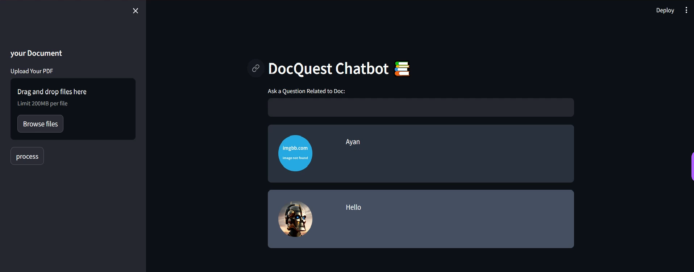
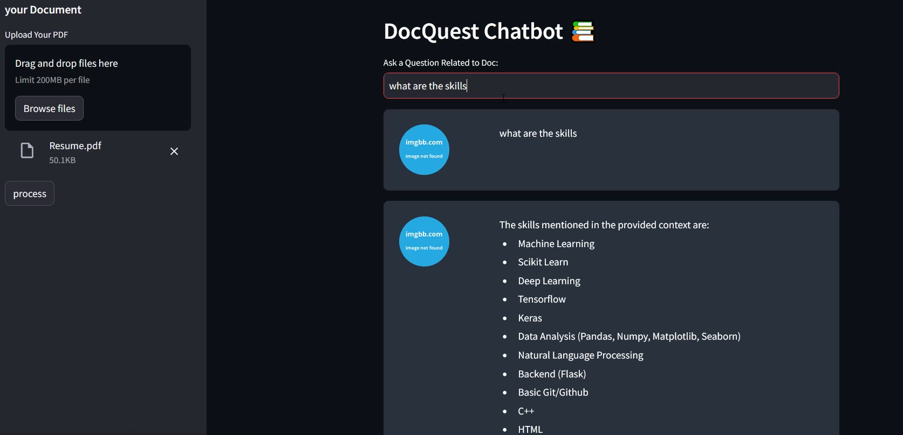

## Docquest Chatbot

### Overview 

# Functionality

## PDF Processing

- **Upload one or more PDF documents.**
  - Users can upload PDF documents through the chatbot interface.

- **Extract text from the PDFs.**
  - The chatbot processes the uploaded PDFs and extracts text from them.

## Text Processing

- **Split the extracted text into chunks for processing.**
  - The extracted text is divided into manageable chunks to facilitate further processing.

## Vector Store

- **Use OpenAI Embeddings to convert text chunks into vectors.**
  - OpenAI Embeddings are applied to transform text chunks into numerical vectors.

- **Store vectors using FAISS.**
  - The vectors obtained from OpenAI Embeddings are stored using the FAISS library for efficient retrieval.

## Conversational Chain

- **Utilize a Conversational Retrieval Chain for chatbot interactions.**
  - A Conversational Retrieval Chain is employed to handle chat interactions, providing a dynamic and context-aware conversation.

## User Input Handling

- **Accept user questions and provide responses using the conversation chain.**
  - Users can input questions related to documents, and the chatbot responds based on the context maintained in the conversation chain.
